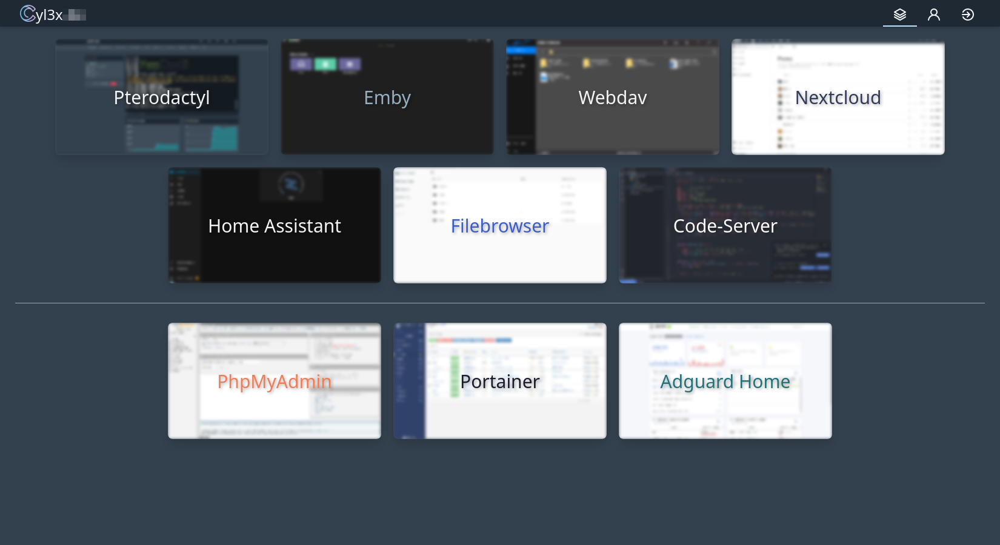
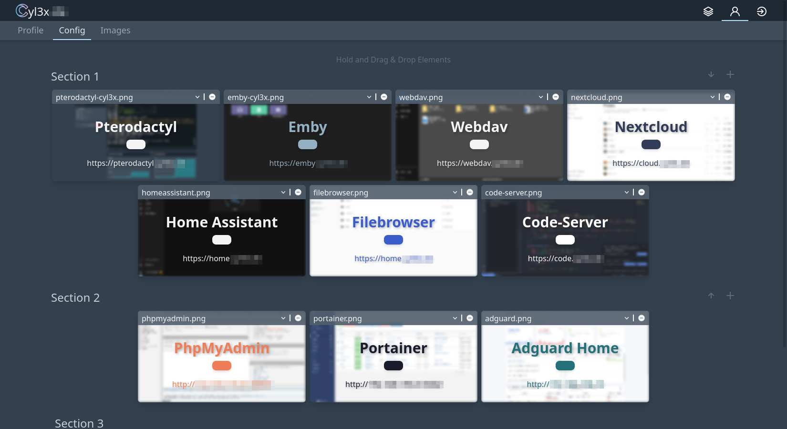

# Dashboard
Das Dashboard ist eine in Vue.js und Laravel Lumen geschriebene Website, die das Anzeigen & Verlinken von Webseiten ermöglicht. 
Ursprünglich geschrieben um mir eine bessere Übersicht über alle installieren & über das Web verfügbaren Services meines Servers zu haben.

## Warum?
Einseits für eine schönere Lesezeichenseite speziell nur für meine Serivces, aber auch als Lernprojekt für
eine _JSON Web Token Authentifizierung_ mit einer bearbeitbaren Konfigurationsdatei

## Installieren
1. `git clone https://github.com/cyl3x/dashboard`
2. `cd dashboard`
3. `docker-compose up -d`
    or 
   <code>
   docker build -t dashboard . \
   && docker volume create dashboard \
   && docker run -dp 5600:80 -v dashboard:/app/var dashboard
   <code>